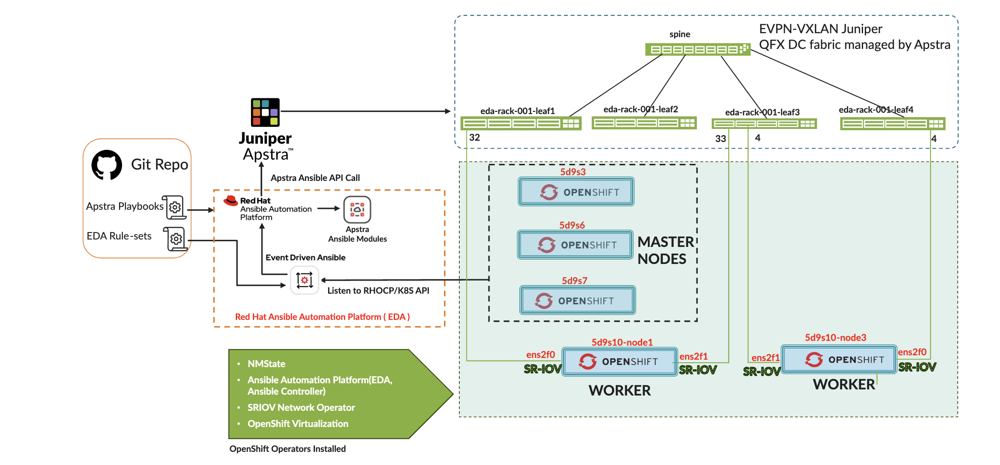
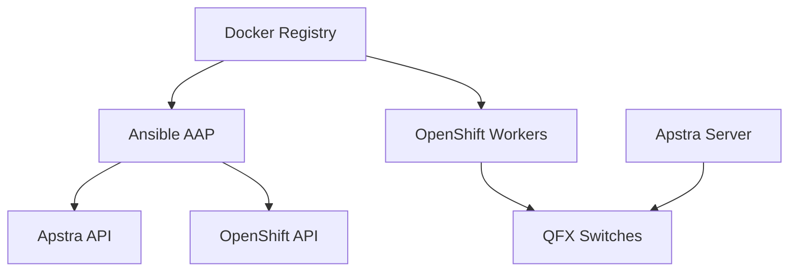
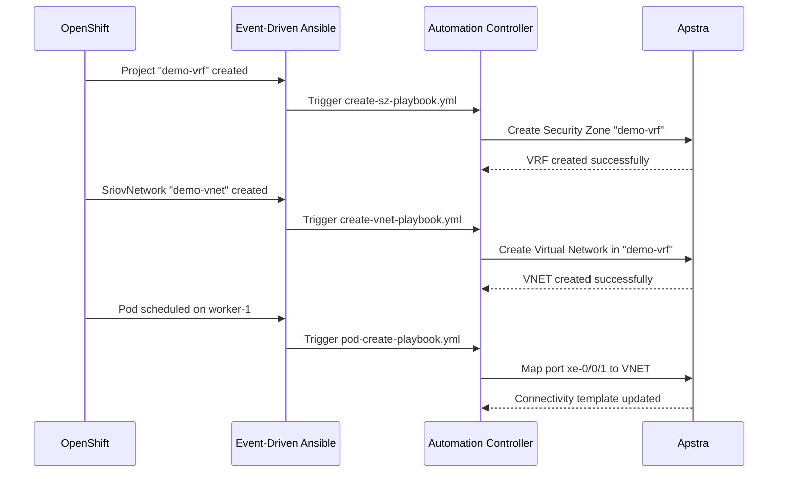

# Juniper Apstra Event-Driven Automation for OpenShift

## Overview

This project enables **seamless integration** between **Red Hat OpenShift Container Platform (RHOCP) 4.17** and **Juniper Apstra** using **Red Hat Ansible Automation Platform 2.5**. It automatically configures network fabric elements (VRFs, VLANs, and connectivity templates) in response to OpenShift resource lifecycle events.

### What This Solves

Traditional enterprise applications in Kubernetes require complex network topologies beyond basic Layer 2 domains. SR-IOV workloads need specific VLAN configurations that traditionally require manual coordination between platform and network teams, leading to delays and errors.

This solution uses **Event-Driven Ansible (EDA)** to automatically:
- Create VRFs when OpenShift Projects are deployed
- Configure Virtual Networks when SriovNetwork resources are created  
- Map Pod and VM connectivity templates dynamically using LLDP discovery
- Maintain network fabric state synchronized with OpenShift resources

### Architecture Overview

```
┌─────────────────┐    ┌────────────────────┐    ┌──────────────────┐
│   OpenShift     │    │  Ansible AAP 2.5   │    │  Juniper Apstra  │
│   Resources     │───▶│  Event-Driven      │───▶│  Fabric Config   │
│   (Projects,    │    │  Automation        │    │  (VRFs, VNETs,   │
│   SriovNet,     │    │  (EDA)             │    │  Conn. Templates)│
│   Pods, VMs)    │    │                    │    │                  │
└─────────────────┘    └────────────────────┘    └──────────────────┘
```

## Quick Start

> **For experienced users:** Jump directly to [Environment Setup](#environment-setup)  
> **For detailed walkthrough:** Continue reading below

## Architecture Diagrams

The following diagrams illustrate the complete integration architecture:

**High-Level System Overview:**

*Shows OpenShift cluster with master and worker nodes,Operators Required to Install, SR-IOV interfaces, and Apstra fabric integration*

## Prerequisites

## Prerequisites

### System Requirements

| Component | Version | Purpose |
|-----------|---------|---------|
| OpenShift Container Platform | 4.17+ | Container orchestration platform |
| Red Hat Ansible Automation Platform | 2.5+ | Event-driven automation and execution |
| Juniper Apstra | 5.0, 5.1, 6.0 | Network fabric management |
| Docker | Latest | Container image management |

### Required OpenShift Operators

The following operators must be installed and configured:

1. **Red Hat Ansible Automation Platform Operator**
   - Provides Automation Controller and Event-Driven Ansible
   - Enables rulebook activation and job execution

2. **Kubernetes NMState Operator** 
   - Manages network interface configuration
   - Required for LLDP neighbor discovery
   - [Installation Guide](https://docs.openshift.com/container-platform/4.15/networking/k8s_nmstate/k8s-nmstate-about-the-k8s-nmstate-operator.html)

3. **OpenShift SR-IOV Network Operator**
   - Enables high-performance networking for workloads
   - [Installation Guide](https://docs.openshift.com/container-platform/4.17/networking/hardware_networks/installing-sriov-operator.html#install-operator-web-console_installing-sriov-operator)

4. **OpenShift Virtualization** (optional)
   - Required only if deploying virtual machines
   - Enables KubeVirt functionality

### Infrastructure Requirements

#### OpenShift Cluster
- **Master Nodes:** Minimum 3 hosts (can be VMs)
- **Worker Nodes:** Minimum 2 hosts (**must be bare metal**)
  - Each worker must have at least one SR-IOV-capable NIC (Intel E810 or XXV710)
  - Each worker needs separate NIC for management and default Kubernetes networking

#### Network Infrastructure  
- **Leaf Switches:** Minimum 2x Juniper QFX5120 or QFX5130
- **Spine Switches:** Minimum 1x Juniper QFX5210 or QFX5220  
- **Apstra Management:** 1x host with external connectivity to switch management networks

#### Docker Registry
- Container registry accessible from OpenShift cluster
- Used for Decision Environment and Execution Environment images
- Can be OpenShift internal registry or external registry

### Network Access Requirements



## Environment Setup

### Phase 1: Docker Environment Preparation

Before configuring Ansible Automation Platform, you must prepare the Decision Environment and Execution Environment container images.

#### Step 1: Download Decision Environment

1. Navigate to [Juniper Support Downloads](https://support.juniper.net/support/downloads/?p=apstra)
2. Go to **Application Tools** section
3. Download the Decision Environment image matching your Apstra version and architecture:
   ```bash
   # Example filename
   juniper-k8s-de-x86_64-1.4.4.image.tgz
   ```

4. Load and tag the Decision Environment image:
   ```bash
   # Load the image
   docker load --input juniper-k8s-de-x86_64-1.4.4.image.tgz
   
   # Tag for your registry
   docker tag juniper-k8s-de:latest your-registry.com/juniper-k8s-de:1.4.4
   
   # Push to registry
   docker push your-registry.com/juniper-k8s-de:1.4.4
   ```

> **📝 Note:** Record the Decision Environment image tag - you'll need it for AAP configuration

#### Step 2: Download Execution Environment

1. From the same Juniper Support Downloads page
2. Download the Execution Environment image:
   ```bash
   # Example filename  
   apstra-ee-x86_64-1.0.1.image.tgz
   ```

3. Load and tag the Execution Environment image:
   ```bash
   # Load the image
   docker load --input apstra-ee-x86_64-1.0.1.image.tgz
   
   # Tag for your registry
   docker tag apstra-ee:latest your-registry.com/apstra-ee:1.0.1
   
   # Push to registry
   docker push your-registry.com/apstra-ee:1.0.1
   ```

> **📝 Note:** Record the Execution Environment image tag - you'll need it for AAP configuration

### Phase 2: RBAC Configuration

Configure Role-Based Access Control (RBAC) for the Event-Driven Ansible integration to access OpenShift resources.

#### Step 1: Apply RBAC Resources

The project includes pre-configured RBAC files that grant necessary permissions for EDA to monitor OpenShift events:

```bash
# Apply the cluster role for EDA operations
oc apply -f rbac/clusterrole.yaml

# Apply the role binding to associate the service account with permissions
oc apply -f rbac/rolebinding.yaml

# Create the service account token secret
oc apply -f rbac/secret.yaml
```

#### Step 2: Verify RBAC Setup

```bash
# Verify cluster role creation
oc get clusterrole eda-server-operator-list-namespaces

# Check role binding
oc get clusterrolebinding eda-server-operator-list-namespaces

# Verify service account and secret in the AAP namespace
oc get secret aap -n aap
oc describe secret aap -n aap
```

#### Step 3: Extract Service Account Token

The service account token will be needed for AAP configuration:

```bash
# Get the service account token for AAP configuration
oc get secret aap -n aap -o jsonpath='{.data.token}' | base64 -d
```

> **🔐 Security Note:** Store this token securely and use it in the AAP configuration for OpenShift integration. This token provides the necessary permissions for EDA to monitor OpenShift resource events.

#### RBAC Permissions Granted

The RBAC configuration provides the following permissions:

| Resource | Access Level | Purpose |
|----------|-------------|---------|
| **All Resources** | **Full Access** | Monitor Projects, SriovNetworks, Pods, VMs, and other OpenShift resources |
| **Namespaces** | **List/Watch** | Detect namespace (project) creation and deletion events |
| **Custom Resources** | **CRUD** | Manage SR-IOV networks and other custom resource definitions |

### Phase 3: LLDP Configuration

Configure LLDP on OpenShift worker nodes to enable automatic switch/port discovery.

#### Step 1: Create LLDP Policy

Create a `NodeNetworkConfigurationPolicy` to enable LLDP on SR-IOV interfaces:

```yaml
apiVersion: nmstate.io/v1
kind: NodeNetworkConfigurationPolicy
metadata:
  name: lldp-node-policy 
spec:
  nodeSelector: 
    node-role.kubernetes.io/worker: ""
  maxUnavailable: 3 
  desiredState:
    interfaces:
      - name: enp4s0f0  # Replace with your SR-IOV interface
        type: ethernet
        lldp:
          enabled: true
      - name: enp4s0f1  # Replace with your SR-IOV interface  
        type: ethernet
        lldp:
          enabled: true
```

#### Step 2: Verify LLDP Neighbors

```bash
# Check LLDP neighbor discovery
kubectl get NodeNetworkState <node-name> -o yaml

# Look for neighbor information:
# lldp:
#   enabled: true  
#   neighbors:
#     - chassis-id: "aa:bb:cc:dd:ee:ff"
#       port-id: "xe-0/0/1"
```

### Phase 4: SR-IOV Node Policies

Configure SR-IOV Virtual Functions on worker nodes.

```yaml
# For Pod workloads (netdevice)
apiVersion: sriovnetwork.openshift.io/v1
kind: SriovNetworkNodePolicy
metadata:
  name: ens2f0-netdev-policy
  namespace: openshift-sriov-network-operator
spec:
  deviceType: netdevice
  needVhostNet: true
  nicSelector:
    pfNames: ["ens2f0"]  # Update interface name
  nodeSelector:
    feature.node.kubernetes.io/network-sriov.capable: 'true'
  numVfs: 8
  resourceName: pod_vfs_ens2f0
---
# For VM workloads (vfio-pci)  
apiVersion: sriovnetwork.openshift.io/v1
kind: SriovNetworkNodePolicy
metadata:
  name: ens2f1-vfio-pci-policy
  namespace: openshift-sriov-network-operator
spec:
  deviceType: vfio-pci
  nicSelector:
    pfNames: ["ens2f1"]  # Update interface name
  nodeSelector:
    feature.node.kubernetes.io/network-sriov.capable: 'true'
  numVfs: 8
  resourceName: vm_vfs_ens2f1
```

## Ansible Automation Platform Configuration

### Prerequisites Verification

Before proceeding, verify all prerequisites are met:

```bash
# Check OpenShift cluster status
oc get nodes
oc get operators

# Verify RBAC configuration
oc get clusterrole eda-server-operator-list-namespaces
oc get clusterrolebinding eda-server-operator-list-namespaces
oc get secret aap -n aap

# Verify SR-IOV operator
oc get pods -n openshift-sriov-network-operator

# Check LLDP configuration  
oc get nncp lldp-node-policy

# Verify worker node SR-IOV capabilities
oc get nodes -l feature.node.kubernetes.io/network-sriov.capable=true
```

Please follow the detailed configuration instructions from [here](./build/apstra-aap-configure/README.md) to configure Ansible Automation Platform.

### Configuration Overview

The configuration process involves:

1. **Project Setup**: Configure source control repositories containing playbooks and rulebooks
2. **Credential Management**: Set up Apstra API credentials and OpenShift service account tokens  
3. **Execution Environment**: Configure container images for automation execution
4. **Decision Environment**: Set up container images for event processing
5. **Rulebook Activation**: Enable event monitoring and automated responses

### Required Configuration Values

Before running the configuration role, gather these values:

| Variable | Description | Example |
|----------|-------------|---------|
| `organization_name` | AAP Organization | `"Apstra-EDA-Org"` |
| `project_url` | Git repository URL | `"https://github.com/Juniper/eda-apstra-project.git"` |
| `project_scm_branch` | Git branch | `"main"` |
| `apstra_blueprint_name` | Apstra blueprint name | `"apstra-eda-blueprint"` |
| `openshift_host` | OpenShift API endpoint | `"https://api.cluster.example.com:6443"` |
| `automation_controller_host` | AAP Controller URL | `"https://aap-controller.apps.cluster.com"` |
| `eda_controller_host` | EDA Controller URL | `"https://eda-controller.apps.cluster.com"` |
| `execution_environment_image_url` | EE image location | `"registry.com/apstra-ee:1.0.1"` |
| `decision_environment_image_url` | DE image location | `"registry.com/juniper-k8s-de:1.4.4"` |

### Running the Configuration

```bash
# Navigate to build directory
cd build/

# Configure variables (use ansible-vault for production)
ansible-vault edit apstra-aap-configure/vars/main.yml

# Run the configuration playbook
ansible-playbook apstra-eda-build.yaml
```

## OpenShift Resource Mappings

Understanding how OpenShift resources map to Apstra objects is crucial for effective automation:

| OpenShift Resource | Apstra Object | Automation Trigger | Description |
|-------------------|---------------|-------------------|-------------|
| **Project** | **Routing Zone (VRF)** | Project Creation/Deletion | Isolated Layer 3 domain for tenant separation |
| **SriovNetwork** | **Virtual Network (VNET)** | SriovNetwork Creation/Deletion | Layer 2 broadcast domain with VLAN assignment |
| **Pod** | **Connectivity Template Entry** | Pod Scheduling | Dynamic port mapping based on LLDP discovery |
| **VirtualMachine** | **Connectivity Template Entry** | VM Creation | Dynamic port mapping for KubeVirt VMs |

### Event Flow Example



## Demonstration Walkthrough

Follow these steps to demonstrate the integration:

### Step 1: Create a Project (Security Zone)

```yaml
# Create a new project that will trigger VRF creation
apiVersion: project.openshift.io/v1
kind: Project
metadata:
  name: apstra-rhocp-demo
  labels:
    type: eda
    pod-security.kubernetes.io/enforce: privileged
    pod-security.kubernetes.io/audit: privileged
    pod-security.kubernetes.io/warn: privileged
    security.openshift.io/scc.podSecurityLabelSync: "false"
  annotations:
    apstra.juniper.net/vrf: '[
      {
        "vrfName": "vrf-demo"
      }
    ]'
```
Apply the configurations:
```bash
oc apply -f project.yaml
```

**Expected Result:** 
- EDA detects project creation event
- `create-sz-playbook.yml` executes automatically  
- New VRF "apstra-demo" appears in Apstra blueprint

### Step 2: Create SR-IOV Virtual Networks

Create two virtual networks for different workload types:

**Network 1: For Pod Workloads**
```yaml
apiVersion: sriovnetwork.openshift.io/v1
kind: SriovNetwork
metadata:
  name: demo-vnet-pods
  namespace: openshift-sriov-network-operator
  labels:
    type: eda
    pfname: ens2f0
  annotations:
    apstra.juniper.net/vnet: '[{
      "vnetName": "demo-vn1", 
      "vrfName": "apstra-demo"
    }]'
spec:
  ipam: |
    {
      "type": "host-local",
      "subnet": "10.100.0.0/24",
      "rangeStart": "10.100.0.10",
      "rangeEnd": "10.100.0.100", 
      "gateway": "10.100.0.1"
    }
  networkNamespace: apstra-demo
  resourceName: pod_vfs_ens2f0
  vlan: 100
```

**Network 2: For VM Workloads**
```yaml
apiVersion: sriovnetwork.openshift.io/v1
kind: SriovNetwork
metadata:
  name: demo-vnet-vms
  namespace: openshift-sriov-network-operator
  labels:
    type: eda
    pfname: ens2f1
  annotations:
    apstra.juniper.net/vnet: '[{
      "vnetName": "demo-vn2",
      "vrfName": "apstra-demo" 
    }]'
spec:
  ipam: |
    {
      "type": "host-local", 
      "subnet": "10.200.0.0/24",
      "rangeStart": "10.200.0.10",
      "rangeEnd": "10.200.0.100",
      "gateway": "10.200.0.1"
    }
  networkNamespace: apstra-demo
  resourceName: vm_vfs_ens2f1
  vlan: 200
```

Apply the configurations:
```bash
oc apply -f demo-vnet-pods.yaml
oc apply -f demo-vnet-vms.yaml
```

**Expected Result:**
- Two virtual networks created in Apstra within "apstra-demo" VRF
- Connectivity templates created but not yet active
- VLAN 100 and 200 configured but no ports assigned

### Step 3: Deploy Pod Workloads

```yaml
apiVersion: apps/v1
kind: Deployment
metadata:
  name: demo-pods
  namespace: apstra-demo
  labels:
    type: eda
    vnet: demo-vn1
spec:
  replicas: 2
  selector:
    matchLabels:
      app: demo-app
  template:
    metadata:
      labels:
        app: demo-app
        type: eda
        vnet: demo-vn1
      annotations:
        apstra.juniper.net/ep: '[{
          "vnetName": "demo-vn1"
        }]'
        k8s.v1.cni.cncf.io/networks: '[{
          "name": "demo-vnet-pods",
          "namespace": "openshift-sriov-network-operator",
          "interface": "net1"
        }]'
    spec:
      containers:
      - name: test-container
        image: registry.access.redhat.com/ubi8/ubi:latest
        command: ["sleep", "infinity"]
        resources:
          requests:
            pod_vfs_ens2f0: 1
          limits:
            pod_vfs_ens2f0: 1
```

```bash
oc apply -f demo-pods.yaml
```

**Expected Result:**
- Pods scheduled on different worker nodes
- LLDP discovers switch ports for each pod location
- Connectivity templates automatically updated with port mappings
- Network connectivity established between pods via fabric

### Step 4: Verify Connectivity

```bash
# List running pods
oc get pods -n apstra-demo

# Get pod IP addresses
oc get pods -n apstra-demo -o wide

# Test connectivity between pods
POD1=$(oc get pods -n apstra-demo -o jsonpath='{.items[0].metadata.name}')
POD2=$(oc get pods -n apstra-demo -o jsonpath='{.items[1].metadata.name}')

# Get the SR-IOV interface IP from pod2
POD2_IP=$(oc exec -n apstra-demo $POD2 -- ip addr show net1 | grep inet | awk '{print $2}' | cut -d/ -f1)

# Ping from pod1 to pod2 via SR-IOV interface
oc exec -n apstra-demo $POD1 -- ping -c 3 $POD2_IP
```

## Troubleshooting

### Common Issues and Solutions

#### 1. Blueprint Lock Error
**Symptom:**
```
fatal: [localhost]: FAILED! => {"changed": false, "msg": "Failed to lock blueprint 4b954fc4-91ba-478e-9f25-3e78168f83ca within 60 seconds"}
```

**Solution:**
1. Unlock blueprint in Apstra UI: **Design > Blueprints > [Blueprint] > Uncommitted > Discard**
2. Restart rulebook activation to trigger `init-done-playbook.yml`
3. Monitor sync process in AAP execution logs

#### 2. LLDP Neighbors Not Discovered
**Symptom:** Pods scheduled but no switch ports configured

**Troubleshooting:**
```bash
# Check LLDP status on worker nodes
oc get NodeNetworkState <worker-node> -o yaml | grep -A 10 lldp

# Verify LLDP is enabled on switch interfaces
# On QFX switches:
show lldp neighbors

# Check if NMState policy is applied
oc get nncp lldp-node-policy -o yaml
```

**Solution:**
- Ensure LLDP is enabled on both OpenShift nodes and switch interfaces
- Verify physical cabling between nodes and switches
- Check NodeNetworkConfigurationPolicy selector matches worker nodes

#### 3. SR-IOV Resources Not Available
**Symptom:** Pods stuck in Pending state with resource allocation errors

**Troubleshooting:**
```bash
# Check SR-IOV node state
oc get sriovnetworknodestates -n openshift-sriov-network-operator

# Verify VF allocation
oc describe node <worker-node> | grep -A 5 "Allocatable:"

# Check SR-IOV operator pods
oc get pods -n openshift-sriov-network-operator
```

**Solution:**
- Verify SR-IOV policies match actual interface names
- Ensure sufficient VFs are allocated (`numVfs` setting)
- Check for conflicting resource names

#### 4. Ansible Automation Platform Connectivity
**Symptom:** Rulebooks not triggering or job failures

**Troubleshooting:**
```bash
# Check EDA controller pod logs
oc logs -n ansible-automation-platform <eda-controller-pod>

# Verify project sync status in AAP UI
# Projects > [Your Project] > Sync Status

# Test Apstra API connectivity
curl -k -u <username>:<password> https://<apstra-url>/api/versions
```

**Solution:**
- Verify network connectivity between AAP and Apstra
- Check credential configuration in AAP
- Ensure project repository is accessible

### Debug Commands

```bash
# Monitor OpenShift events
oc get events -n apstra-demo --sort-by='.firstTimestamp'

# Check Apstra EDA rulebook logs
oc logs -f deployment/eda-controller -n ansible-automation-platform

# View SR-IOV network status
oc get sriovnetworks -A

# Check pod network attachments
oc get network-attachment-definitions -A

# Verify Apstra blueprint status via API
curl -k -u admin:admin https://apstra-server/api/blueprints/<blueprint-id>/status
```

### Performance Monitoring

Monitor the automation performance and health:

```bash
# Check automation job execution times
# In AAP UI: Automation Execution > Jobs > Filter by time range

# Monitor resource utilization
oc top nodes
oc top pods -n ansible-automation-platform

# Check event processing latency
# Compare OpenShift event timestamps with AAP job start times
```

## Additional Resources

### Documentation Links
- [Red Hat Ansible Automation Platform Documentation](https://docs.redhat.com/en/documentation/red_hat_ansible_automation_platform/2.5/)
- [OpenShift Container Platform Documentation](https://docs.openshift.com/)
- [Juniper Apstra Documentation](https://www.juniper.net/documentation/product/us/en/apstra/)
- [SR-IOV Network Operator Guide](https://docs.openshift.com/container-platform/4.17/networking/hardware_networks/about-sriov.html)

### Video Resources
- [Demo Video: RHOCP-Apstra Integration](https://www.youtube.com/watch?v=A9UfKUNvUdc)
- [Juniper Blog: Seamless Network Integration](https://blogs.juniper.net/en-us/ai-data-center-networking/seamless-network-integration-connecting-openshift-to-your-data-center-with-apstra)

### Reference Repositories
- [Demo Implementation Example](https://github.com/pvs2401/rhocp-apstra-integration)
- [Upstream Kubernetes Documentation](./tests/upstream/README.md)

## Notes for Production Deployment

1. **Security Best Practices**
   - Use Ansible Vault for all sensitive variables
   - Implement RBAC for AAP access
   - Secure OpenShift service account tokens
   - Use TLS for all API communications

2. **High Availability Considerations**
   - Deploy AAP with multiple controller nodes
   - Use external database for AAP components
   - Implement backup strategies for configurations

3. **Monitoring and Alerting**
   - Set up monitoring for rulebook activations
   - Configure alerts for automation job failures
   - Monitor Apstra blueprint lock status

4. **Change Management**
   - Version control all playbooks and configurations
   - Test automation changes in development environment
   - Implement approval workflows for production changes

---

## License
This project is licensed under the MIT License. See `LICENSE` for more details.

## Contact
For questions or issues, please reach out to:
- **Author:** Pratik Dave
- **Email:** pratikd@juniper.net
- **Repository Issues:** [GitHub Issues](https://github.com/Juniper/eda-apstra-project/issues)

